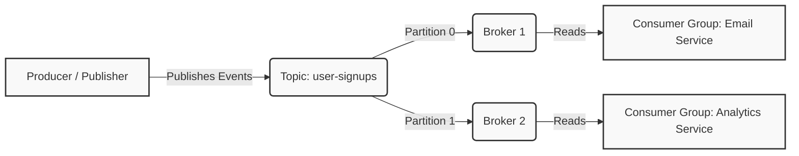
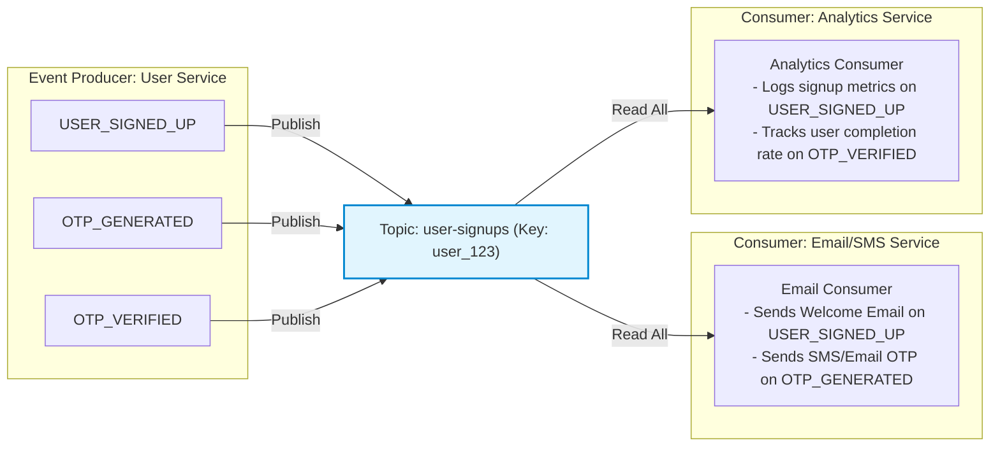
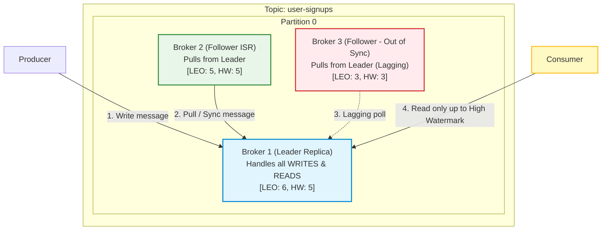
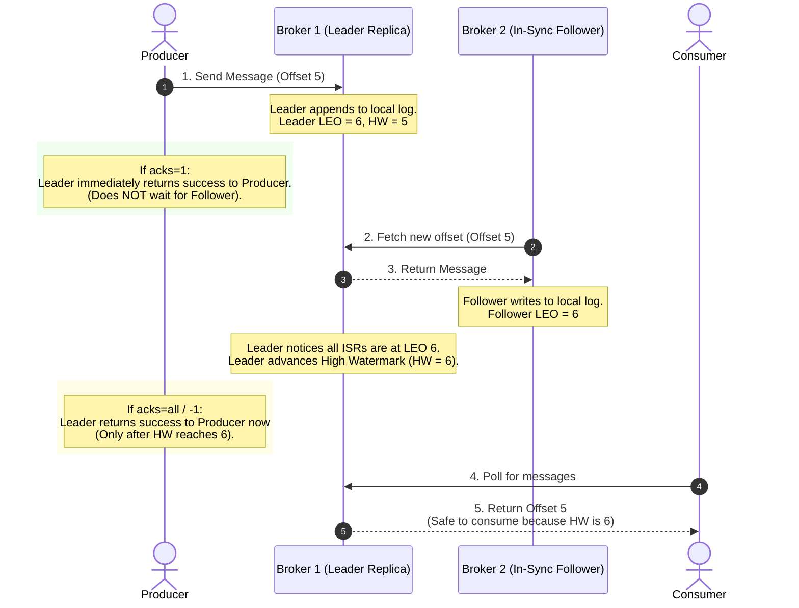
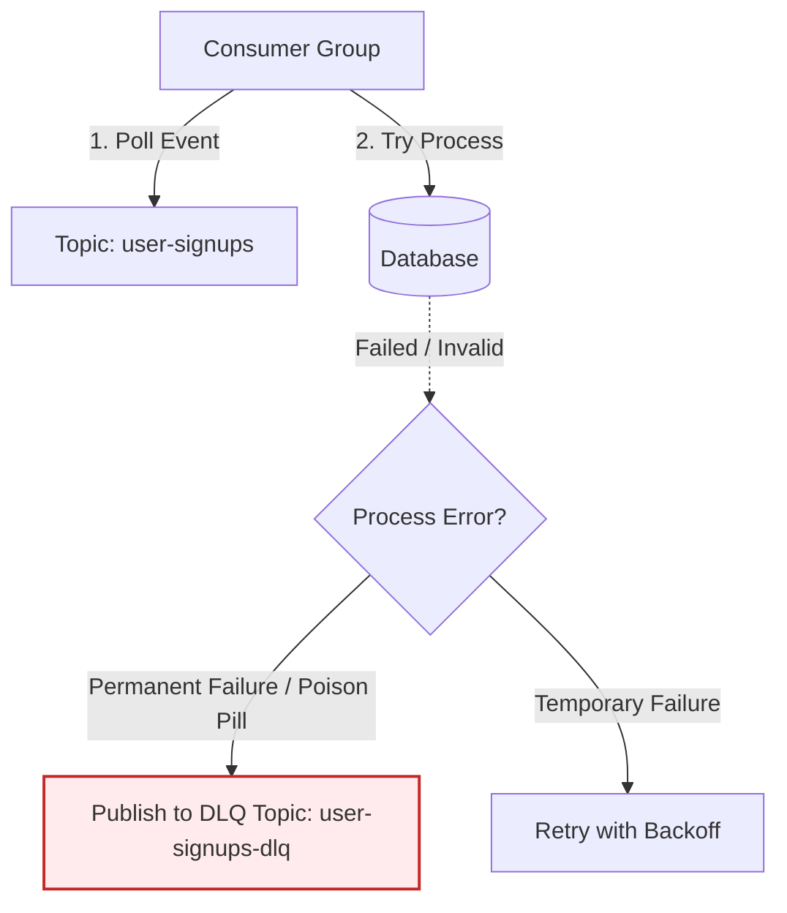
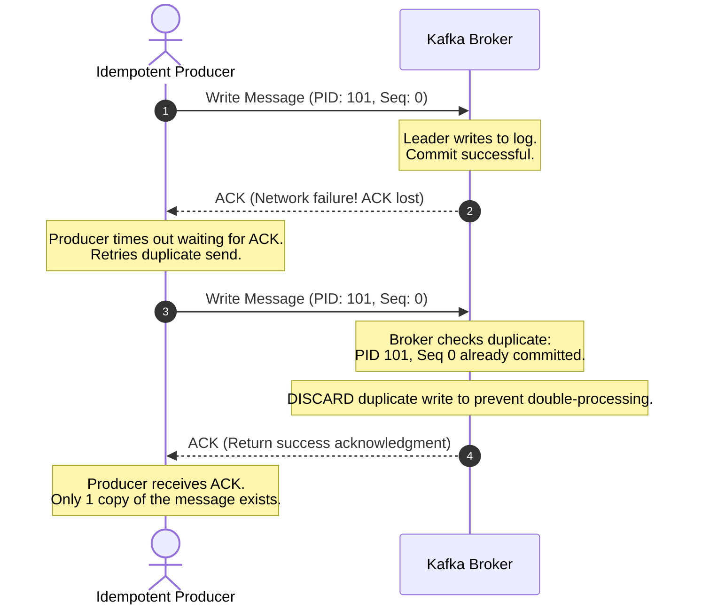

# Apache Kafka & Integration Learning Guide

This document provides an in-depth explanation of Apache Kafka's core concepts, consensus architectures (ZooKeeper vs. KRaft), the architectural goals of our project, and a detailed line-by-line walkthrough of our Node.js implementation.

---

## 📖 Part 1: What is Apache Kafka?

**Apache Kafka** is a distributed event store and stream-processing platform. It is designed to handle high-throughput, low-latency, real-time data feeds. 

Unlike traditional databases that store the **current state** of data, Kafka stores a **log of events** (history of what happened).

### Core Event Streaming Concepts



#### 1. Events (Messages)
An **Event** (also called a **Message**) represents something that happened in the real world. In Kafka, an event is written as a key-value pair, with a timestamp:
* **Key:** Used to determine which partition the message is sent to (e.g., `userId`).
* **Value:** The actual data payload (e.g., a JSON object describing the event: `{"event": "USER_CREATED", "payload": {...}}`).
* **Timestamp:** When the event occurred.

#### 2. Event Streaming
Event streaming is the practice of capturing data in real-time from event sources (databases, mobile devices, applications) as a continuous stream of events, storing them durably, and reacting to them immediately.

#### 3. Topics & Partitions
* **Topic:** A folder or category name where events are stored. For example, `user-signups`. Topics are multi-producer and multi-consumer.
* **Partitions:** Topics are split into **Partitions** spread across different servers (Brokers). This allows Kafka to scale.
  * Within a partition, messages are strictly ordered by arrival time and are append-only.
  * To scale consumption, you increase the number of partitions.

#### 4. Message Offset
An **Offset** is a sequential integer ID assigned to each message when it is written to a partition.
* Offsets are unique *only* within a specific partition.
* Consumers track their progress by saving (committing) the offset of the last message they successfully processed. If a consumer crashes and restarts, it starts reading from its last committed offset.

#### 5. Publisher (Producer)
Producers are client applications that publish (write) events to Kafka topics. The producer chooses which partition to write to, typically using a hashing algorithm on the message key (e.g., `hash(key) % total_partitions`) to ensure all events for a specific key (like a user ID) land in the same partition and remain in order.

#### 6. Consumer & Consumer Groups
Consumers are client applications that subscribe to (read and process) events from topics.
* **Consumer Group:** A group of consumers working together to read from a topic.
* **The Rule of Scale:** Each partition in a topic can only be read by *one* consumer in a consumer group at a time. If you have 3 partitions and a group of 3 consumers, each consumer reads from exactly 1 partition. If you add a 4th consumer, it will sit idle.
* Different consumer groups (e.g. `email-service` and `analytics-service`) read independently and will each receive every single message on the topic.

#### 7. Broker
A **Broker** is a single Kafka server node running in a cluster. 
* Brokers receive messages from producers, write them to disk, and serve them to consumers.
* A cluster consists of multiple brokers to share the load and provide data replication (if one broker crashes, another has a copy of the partition).

### 💡 Events vs. Topics (Deep Dive with User Creation Example)

It is common to confuse **Events** and **Topics**, but they represent two different concepts in event-driven systems:

| Concept | Definition | Example (User Creation Feature) | Analogies |
| :--- | :--- | :--- | :--- |
| **Topic** | The **logical category, folder, or channel** where messages are sent and stored. It is a durable append-only log of events. | `user-signups` *(The channel where all signup events are routed)* | A mailbox, a folder on disk, or a database table. |
| **Event** | An **individual immutable message** containing a fact—a statement about something that has already happened in the real world. | `USER_SIGNED_UP` *(The message containing the new user's details)* | A specific letter, a file inside a folder, or a row in a table. |

#### 🚗 Famous Real-World Example: Uber Rides

To see how scale companies design this, look at **Uber**:
* **Topic**: `ride-lifecycle` (The stream/channel for coordinating a single trip).
* **Events**: Milestones that represent historical facts occurring sequentially:
  1. `RideRequested`: Triggered when the rider requests a ride.
  2. `DriverAssigned`: Triggered when a driver accepts the trip.
  3. `DriverArrived`: Triggered when the driver reaches the pickup spot.
  4. `RideStarted`: Triggered when the passenger enters the car and the ride begins.
  5. `RideCompleted`: Triggered when the driver drops off the passenger.

#### Real-world Walkthrough: User Creation Feature

When a new user registers on the platform, the following sequence occurs:

1. **The Event Occurs:** The user clicks "Sign Up", and the database saves the user. The signup becomes an immutable fact: **"A new user signed up"**.
2. **The Producer Publishes the Event:** The user service instantiates the event structure:
   - **Event Name:** `USER_SIGNED_UP` (named in the **past tense** to denote a historical fact).
   - **Event Payload:**
     ```json
     {
       "event": "USER_SIGNED_UP",
       "timestamp": "2026-08-07T07:07:02Z",
       "payload": {
         "id": 42,
         "email": "alice@example.com",
         "name": "Alice Smith"
       }
     }
     ```
3. **The Topic Routes it:** This event is sent to the topic named `user-signups`.
4. **The Consumers Read it:** Consumer groups (like `email-service-group` and `analytics-service-group`) subscribe to the `user-signups` **topic** to read, deserialize, and process each individual **event** independently.

#### 🔄 Can a single Topic have more than one type of Event?
**Yes, absolutely!** In production-grade Event-Driven Architectures, grouping multiple related event types within a single topic is a common, powerful design pattern known as the **Domain-Boundary Topic** or **Multi-Event Topic** pattern.

Instead of creating separate topics for every single step of user registration, we can route all related events through our `user-signups` (or a broader `user-lifecycle`) topic.

##### The Multi-Event Flow Scenario
During user registration, the system might produce a series of distinct events:
1. `USER_SIGNED_UP`: Triggered when the user submits their registration details.
2. `OTP_GENERATED`: Triggered when a one-time verification password is created.
3. `OTP_VERIFIED`: Triggered when the user successfully verifies their account.
4. `ONBOARDING_COMPLETED`: Triggered when the user finishes setting up their profile metrics.



##### Why use a Single Topic for multiple events?
1. **Strict Ordering Guarantees**: Kafka only guarantees message ordering *within a single partition of a topic*. If you put `USER_SIGNED_UP` in one topic and `OTP_VERIFIED` in another, a consumer group could read the verification event *before* the signup event if one consumer group falls behind. By sending both events to `user-signups` with the same partition key (like `userId`), you guarantee they are processed in the exact order they occurred.
2. **Lower Broker Overhead**: Every topic and partition in a Kafka cluster requires metadata management, file descriptors, and CPU cycles on the brokers. Grouping lifecycle events into a single domain-boundary topic reduces cluster resource usage compared to creating dozens of single-event topics.
3. **Consumer Flexibility**: Consumers subscribe to the topic once, inspect the `"event"` field in the payload, and use a `switch` statement or router to selectively handle only the events they care about.

---

### 🗂️ How Partitions, Replicas, & Synchronization Work

Kafka's reliability, ordering guarantees, and high performance stem from how partitions are distributed, replicated, and kept in sync across brokers.



---

#### 1. Why is there only ONE Write Replica (The Leader)?
Every partition has one designated **Leader** replica and zero or more **Follower** replicas. 
* **The Single Source of Truth**: To guarantee a strict sequence of events (ordering), **all writes must go to the Leader**.
* **Why not multiple write replicas?** If multiple replicas could accept writes concurrently, they could write different messages to the same index/offset at the same time. Resolving these write conflicts across a distributed network (like Git merges or CRDTs) is slow and highly complex. Having a single leader ensures that offsets are assigned sequentially and unambiguously without lock contention.
* **Reads**: By default, consumers also read only from the Leader. (Note: Modern Kafka supports fetching from the closest follower replica to save cross-AZ network costs, but the Leader remains the sole authority for the true order of the log).

---

#### 2. Log End Offset (LEO) vs. High Watermark (HW)
To understand synchronization, Kafka uses two pointer offsets:
* **Log End Offset (LEO)**: The offset of the *next* message to be written in a specific replica's log. It represents the total messages that replica has received.
* **High Watermark (HW)**: The offset of the last message that has been successfully copied to **all In-Sync Replicas (ISR)**. 

##### 🏦 Famous Real-World Analogy: The Bank Vault & Shared Ledgers
Imagine a bank with 3 branches tracking deposits in sequential transaction logbooks. 
* **Branch 1 (Leader)**: The main branch where customers write deposits.
* **Branch 2 & 3 (Followers)**: Backup branches that copy transactions from Branch 1's book.

Here is how Kafka concepts map to this:

| Term | Bank Analogy | Example |
| :--- | :--- | :--- |
| **Event** | A transaction slip. | `"Deposit $100 into Account A"` |
| **Log End Offset (LEO)** | The total number of lines written in a branch's local logbook. | Branch 1 has written 6 transactions (LEO = 6). Branch 2 has copied only 5 (LEO = 5). |
| **High Watermark (HW)** | The last transaction line that has been copied by **every active branch**. | Since Branch 2 has only copied up to transaction 5, the High Watermark is 5. Transaction 6 is not yet "fully safe." |
| **In-Sync Replicas (ISR)** | The list of active branches that are copying transactions quickly and haven't fallen behind. | Branch 2 is in-sync. Branch 3 took a lunch break and hasn't written anything for 30 minutes, so it is kicked out of the ISR. |

---

#### 3. Does a Consumer take the existing message or wait for sync?
**The Consumer always waits for synchronization before it can read a message.** 

Consumers are only allowed to read up to the **High Watermark (HW)**.
* In our Bank Analogy: Even though the main branch (Branch 1) has written Transaction 6, it will **not show Transaction 6 on bank statements** (it is invisible to the consumer).
* Why? Because if the main branch catches fire before Branch 2 copies it, Transaction 6 vanishes. By making consumers wait until the High Watermark reaches 6 (all vaults have copies), Kafka prevents **Dirty Reads** (reading money/data that eventually disappears).

---

#### 4. The Producer's Role: Choosing the Sync Tradeoff (`acks`)
When sending messages, the producer controls how long it waits for replication via the `acks` configuration. Let's map it to our Bank Analogy:

* **`acks=0`**: The customer drops a deposit slip in the mail slot and walks away. No confirmation, high risk.
* **`acks=1` (Default)**: The teller at the main branch (Leader) stamps the slip and says "Done." Fast, but if the main branch burns down before copying to the vaults, the deposit is lost.
* **`acks=all` (or `-1`)**: The teller makes the customer wait until the vaults (ISR) successfully copy the transaction. Max safety.



* **`acks=0`**: The producer doesn't wait for any response from the broker. Extremely fast, but zero delivery guarantee.
* **`acks=1`**: The producer waits for the Leader to write the message locally. It does not wait for followers. If the leader crashes before followers pull the message, the data is lost.
* **`acks=all` (or `-1`)**: The producer blocks until the leader has received the message AND all active **In-Sync Replicas** have copied it (advancing the HW). This ensures zero data loss.

---

#### 5. How Kafka Handles Inconsistencies and Sync Lag
What happens if a follower is offline, slow, or falls behind?

* **In-Sync Replicas (ISR) Quorum**: Kafka tracks which replicas are keeping up. If a follower fails to fetch messages within a timeout window (configured by `replica.lag.time.max.ms`, e.g., 30 seconds), the Leader automatically kicks it out of the ISR list.
* **Preventing Deadlocks**: If a follower is kicked out of the ISR, it no longer holds back the High Watermark. The HW can advance based only on the remaining healthy members of the ISR.
* **Reconciling Differences on Recovery (Truncation)**:
  * When a crashed/offline follower starts back up, it looks at the Leader's last known **High Watermark**.
  * The follower **truncates** its local log down to that High Watermark (throwing away any uncommitted messages that weren't fully replicated before the crash).
  * The follower then pulls messages from the leader starting from that point until it catches up and is welcomed back into the ISR.
  * If the **Leader crashes**, the controller quorum elects a new leader from the ISR. All remaining followers immediately truncate their logs to match the new leader's history, preventing mismatched order or duplicate offsets.

#### 🎬 Famous Real-World Example: Netflix Video Playback Tracking

To guarantee fault tolerance under massive load, look at **Netflix**:
* When you watch a movie, your device periodically publishes a playback offset event (e.g., `"movie_id": 402, "paused_at_seconds": 1202`) to a tracking partition on Broker 1 (the Leader).
* This event is continuously replicated to Broker 2 and Broker 3 (the Followers in the ISR).
* If Broker 1 experiences a hardware crash, the Kafka controller immediately elects Broker 2 as the new Leader.
* Because the playback event had been replicated to Broker 2 before the crash (the High Watermark was advanced), your video does not stutter, and when you resume on another device, you do not lose your spot.

---

## 🛠️ Part 2: ZooKeeper vs. KRaft (Consensus Architectures)

For a distributed system like Kafka to work, all brokers must agree on metadata (who is the leader of which partition, which brokers are alive, etc.).

### The ZooKeeper Way
Historically, Kafka relied on **Apache ZooKeeper** to maintain cluster state, manage configuration, elect partition leaders, and detect broker failures.
* **How it worked:** ZooKeeper ran as a separate cluster outside of Kafka. Kafka brokers communicated with ZooKeeper to fetch metadata.
* **The Zab Algorithm (ZooKeeper Atomic Broadcast):** ZooKeeper uses Zab, a crash-recovery consensus protocol similar to Paxos/Raft. It establishes a primary-backup system where a leader broker processes all requests and broadcasts changes to follower brokers, requiring a quorum (majority) to agree.
* **Why ZooKeeper was deprecated:**
  1. **Dual System Overhead:** Managing two separate distributed systems (Kafka and ZooKeeper) is complex.
  2. **Metadata Bottleneck:** When a partition leader failed, ZooKeeper had to orchestrate the election of a new leader. With millions of partitions, ZooKeeper became slow, causing cluster-wide stall times.
  3. **Security/Network Complexity:** Setting up security policies (SSL/SASL) across two different systems is error-prone.

### The KRaft Way (Kafka Raft Metadata Mode)
Starting in modern Kafka (and used in our project's `docker-compose.yml` with version `3.9.1`), ZooKeeper is replaced by **KRaft**.
* **How it works:** Kafka manages its own metadata natively. A small subset of Kafka brokers are designated as "Controllers" and form a raft quorum.
* **The Raft-variant Algorithm:** KRaft uses a consensus protocol based on Raft. Metadata changes are written to an internal metadata topic (the metadata log). The controller quorum uses Raft consensus to replicate these metadata updates.
* **Advantages:**
  * No external ZooKeeper dependencies (simpler setup).
  * Can scale to support millions of partitions.
  * Near-instantaneous partition leader elections and cluster recovery.

---

## 🎯 Part 3: What We Built & Why

### The Business Goal (Why we did it)
In a traditional monolithic application, when a user signs up:
1. The app writes the user to the database.
2. The app calls an SMTP service to send a welcome email (takes 1-3 seconds).
3. The app logs sign-up metrics to an analytics service (takes 500ms).
4. The app returns a `201 Created` HTTP response to the user.

**The Problem:** If the email provider is down or slow, the user signup fails or hangs. If the analytics tracker is overloaded, the signup endpoint times out.

### The Decoupled Event-Driven Solution (What we made)
We decoupled these steps using Kafka:
1. **User Service (Database + Producer):** Saves user to PG Database, publishes a `USER_CREATED` event to the `user-signups` topic, and immediately returns success to the user (takes ~15ms).
2. **Email Service (Consumer Group 1):** Listens to `user-signups`, detects a new user, and sends the email asynchronously.
3. **Analytics Service (Consumer Group 2):** Listens to `user-signups` and tracks the signup statistics asynchronously.

If the email server goes offline, user signups still work! The email consumer will simply resume sending emails when it comes back online by reading from its last committed offset in Kafka.

---

## 🔍 Part 4: Line-by-Line Code Walkthrough

Here is the explanation of every line of our refactored codebase.

---

### File 1: Kafka Client Configuration
📄 **[src/config/kafka.js](file:///d:/kafka-demo/src/config/kafka.js)**
*Purpose: Initializes the Kafka client, sets up the topics, and manages the lifecycle of the single, shared producer.*

```javascript
// 1. Import Kafka and Partitioners classes from kafkajs module.
const { Kafka, Partitioners } = require('kafkajs');

// 2. Disable default legacy partitioner warning logs.
process.env.KAFKAJS_NO_PARTITIONER_WARNING = '1';

// 3. Instantiate the Kafka client configuration.
const kafka = new Kafka({
  clientId: 'kafka-learning', // Unique ID identifying this client application.
  // Split brokers string by comma (e.g. 'localhost:9092') into an array.
  brokers: (process.env.KAFKA_BROKERS || 'localhost:9092').split(','),
  createPartitioner: Partitioners.LegacyPartitioner, // Selects partition hashing strategy.
  retry: {
    retries: 10,             // Number of connection retries before failing.
    initialRetryTime: 300,   // Delay in milliseconds before first retry.
    factor: 0.2,             // Exponential backoff scaling factor.
  },
});

// 4. Create a single, long-lived producer instance.
const producer = kafka.producer();

// 5. Definition of the startup function to initialize Kafka.
const initKafka = async () => {
  // Why do we create a separate Admin Client?
  // In KafkaJS, client capabilities are strictly separated into three APIs:
  // 1. Producer: Optimized for publishing messages. Cannot perform admin tasks.
  // 2. Consumer: Optimized for reading messages. Cannot perform admin tasks.
  // 3. Admin: Designed for cluster management (creating topics, checking broker status, listing offsets).
  // Therefore, to create our topics dynamically on startup, we must instantiate an Admin instance.
  const admin = kafka.admin();
  await admin.connect(); // Establish admin TCP connection.

  try {
    // Attempt to pre-create topics with specific partitions.
    await admin.createTopics({
      waitForLeaders: true, // Block execution until topic partition leaders are elected.
      topics: [
        {
          topic: 'user-signups',
          numPartitions: 3,     // Scalable configuration: 3 partitions allows up to 3 parallel consumers.
          replicationFactor: 1, // Number of copies of partition data (1 since we have 1 broker in dev).
        },
      ],
    });
  } catch (error) {
    const message = error.message || '';
    // Catch-block to gracefully ignore errors if the topic already exists.
    if (
      error.type === 'TOPIC_ALREADY_EXISTS' ||
      /already exists/i.test(message) ||
      /Topic creation errors/i.test(message)
    ) {
      // Safe to ignore.
    } else {
      throw error; // Rethrow other critical errors.
    }
  } finally {
    await admin.disconnect(); // Disconnect admin client to free up connections.
  }

  // Connect the global long-lived producer to the cluster.
  await producer.connect();
  console.log('⚡ Kafka Producer connected successfully');
};

// 6. Function to gracefully terminate the producer.
const shutdownKafka = async () => {
  console.log('🔌 Shutting down Kafka producer...');
  await producer.disconnect();
};

// 7. Export dependencies for consumption in other files.
module.exports = {
  kafka,
  producer,
  initKafka,
  shutdownKafka,
};
```

---

### File 2: Kafka Producer Service
📄 **[src/kafka/producer.js](file:///d:/kafka-demo/src/kafka/producer.js)**
*Purpose: Exposes a helper to send events to Kafka.*

```javascript
// 1. Import the pre-connected, global producer instance.
const { producer } = require('../config/kafka');

// 2. Helper function to publish a JSON message to a topic.
const produceMessage = async (topic, message) => {
    // Call the kafkajs send command.
    await producer.send({
        topic,
        // Messages array accepts value as a string/Buffer. We stringify the JSON payload.
        messages: [{ value: JSON.stringify(message) }],
    });
};

module.exports = { produceMessage };
```

---

### File 3: Kafka Consumer Engine
📄 **[src/kafka/consumer.js](file:///d:/kafka-demo/src/kafka/consumer.js)**
*Purpose: Handles consumer groups registration, subscription, message loop, and teardown.*

```javascript
// 1. Import the configured kafka client.
const { kafka } = require('../config/kafka');

// 2. Track all started consumer instances to disconnect them on shutdown.
const activeConsumers = [];

// 3. Centralized helper to register and start any consumer group.
const runConsumer = async ({ topic, groupId, onMessage }) => {
  // Create a new consumer group instance.
  const consumer = kafka.consumer({ groupId });
  
  await consumer.connect(); // Establish connection.
  // Subscribe to topic. fromBeginning: true forces consumer to read past messages
  // if this is a brand new consumer group with no committed offset history.
  await consumer.subscribe({ topic, fromBeginning: true });
  
  // Start the message polling/processing loop.
  await consumer.run({
    // eachMessage is executed by KafkaJS for every incoming message.
    eachMessage: async ({ topic, partition, message }) => {
      try {
        // Convert Buffer message payload to string.
        const value = message.value ? message.value.toString() : null;
        // Delegate message processing logic to service callback.
        await onMessage(value);
      } catch (err) {
        // Catch-all prevents a single failing message from crashing the entire server.
        console.error(`❌ Error processing message on topic ${topic}:`, err);
      }
    },
  });

  // Track the running consumer.
  activeConsumers.push(consumer);
  console.log(`📥 Consumer group "${groupId}" listening on topic "${topic}"`);
  return consumer;
};

// 4. Graceful shutdown handler.
const shutdownConsumers = async () => {
  console.log('🔌 Shutting down active Kafka consumers...');
  for (const consumer of activeConsumers) {
    try {
      await consumer.disconnect(); // Disconnect each consumer cleanly.
    } catch (err) {
      console.error('Error disconnecting consumer:', err);
    }
  }
};

module.exports = { runConsumer, shutdownConsumers };
```

---

### File 4: Consumer Services
📄 **[src/services/analytics.consumer.js](file:///d:/kafka-demo/src/services/analytics.consumer.js)**
*Purpose: Evaluates metric reports on user signups.*

```javascript
// Import the centralized consumer engine and topic constant.
const { runConsumer } = require('../kafka/consumer');
const { USER_SIGNUPS } = require('../kafka/topic');

const initAnalyticsConsumer = async () => {
  await runConsumer({
    topic: USER_SIGNUPS,
    groupId: 'analytics-service-group', // Separate group ensures it gets ALL user-signups events.
    onMessage: async (messageStr) => {
      console.log(`📊 Analytics consumer received message: ${messageStr}`);
      // Add analytics processing database logic here.
    },
  });
};

module.exports = { initAnalyticsConsumer };
```

📄 **[src/services/email.consumer.js](file:///d:/kafka-demo/src/services/email.consumer.js)**
*Purpose: Sends out notification emails when user signups occur.*

```javascript
const { runConsumer } = require('../kafka/consumer');
const { USER_SIGNUPS } = require('../kafka/topic');

const initEmailConsumer = async () => {
  await runConsumer({
    topic: USER_SIGNUPS,
    groupId: 'email-service-group', // Independent consumer group.
    onMessage: async (messageStr) => {
      console.log(`📧 Email consumer received message: ${messageStr}`);
      // Add SMTP / third-party email transmission logic here.
    },
  });
};

module.exports = { initEmailConsumer };
```

---

### File 5: Server Entry Point
📄 **[src/server.js](file:///d:/kafka-demo/src/server.js)**
*Purpose: Entrypoint that orchestrates database connections, Kafka client/consumer startup, and listens for process termination signals.*

```javascript
const app = require('./app');
const db = require('./config/database');
const { initKafka, shutdownKafka } = require('./config/kafka');
const { shutdownConsumers } = require('./kafka/consumer');
const { initAnalyticsConsumer } = require('./services/analytics.consumer');
const { initEmailConsumer } = require('./services/email.consumer');

const PORT = process.env.PORT || 3000;

const start = async () => {
  // 1. Connect to PostgreSQL and sync database tables.
  await db.initDb();
  
  // 2. Initialize Kafka, create topic, and connect global producer.
  await initKafka();

  // 3. Spin up both consumer background tasks.
  await initAnalyticsConsumer();
  await initEmailConsumer();

  // 4. Start listening for incoming HTTP requests on Express.
  const server = app.listen(PORT, () => {
    console.log(`🚀 Server running on http://localhost:${PORT}`);
  });

  // 5. Graceful Shutdown orchestration function.
  const handleShutdown = async (signal) => {
    console.log(`\n🛑 Received ${signal}. Starting graceful shutdown...`);
    
    // Stop accepting new HTTP requests.
    server.close(() => console.log('HTTP server closed.'));
    
    try {
      // Disconnect all consumer group pollers to trigger partition rebalancing on broker.
      await shutdownConsumers();
      // Disconnect the shared producer connection.
      await shutdownKafka();
      console.log('✅ Graceful shutdown complete.');
      process.exit(0); // Exit process successfully.
    } catch (err) {
      console.error('❌ Error during graceful shutdown:', err);
      process.exit(1); // Exit process with failure.
    }
  };

  // Register OS termination signal listeners.
  process.on('SIGINT', () => handleShutdown('SIGINT'));   // Triggered by Ctrl+C.
  process.on('SIGTERM', () => handleShutdown('SIGTERM')); // Triggered by process manager/docker.
};

// Start application, catch global boot failures.
start().catch((error) => {
  console.error('❌ Failed to start server:', error);
  process.exit(1);
});
```

---

## ⚡ Part 5: Common Kafka Bottlenecks & Solutions

When running Kafka in production, scale and load will eventually hit hardware or network limits. Here are the major bottlenecks and how they are solved:

### 1. Consumer Lag (Slow Consumers)
* **The Bottleneck:** The producer is publishing messages faster than the consumer can process them. This causes the consumer offset to fall far behind, leading to delayed events (e.g. users receiving welcome emails 10 minutes late).
* **The Solutions:**
  1. **Scale Out (Increase Partitions and Consumers):** If your topic has 1 partition, only 1 consumer in a group can process it. By increasing the topic's partition count (e.g., to 3 or 6 partitions) and running multiple consumer instances in the same group, you scale your processing capacity horizontally.
  2. **Worker Pool Delegation:** Instead of doing heavy, blocking work (e.g., rendering PDF, contacting slow third-party APIs) directly inside the `eachMessage` handler, the consumer can hand off the work to an in-memory queue/worker pool (like a Node.js worker pool or async queue library) and return immediately.
  3. **Batch Processing (`eachBatch`):** Process messages in batches rather than one-by-one. This reduces database transaction overhead (e.g., executing one bulk database `INSERT` instead of 100 individual queries).

### 2. Consumer Rebalance Storms
* **The Bottleneck:** A consumer takes too long to process a batch of messages. Because it is blocked, it fails to send its periodic "heartbeat" to the Kafka coordinator broker. The broker thinks the consumer died, kicks it out of the group, and triggers a **rebalance** (reassigning its partitions to other consumers). This stops all consumption during the rebalance, and if the other consumers also block, it triggers a chain reaction of failures.
* **The Solutions:**
  1. **Increase Poll Intervals:** Adjust the consumer client configuration `max.poll.interval.ms` to give your code more time to process messages before Kafka assumes it's dead.
  2. **Decrease Batch Size:** Limit the maximum number of messages returned in a single poll (`max.poll.records`).

### 3. Producer Latency (TCP & Disk Overhead)
* **The Bottleneck:** High latency on publishing messages, causing web requests to hang.
* **The Solutions:**
  1. **Connection Reuse:** Do not connect and disconnect on every request (which we resolved in our refactoring by sharing the producer!).
  2. **Configure Acknowledgment Levels (`acks`):**
     * `acks=0`: Producer doesn't wait for any broker reply. Fastest, but messages can be lost if a broker crashes.
     * `acks=1` (Default): Producer waits for the partition leader broker to write the message to disk. Good balance of speed and reliability.
     * `acks=all`: Producer waits for all replica brokers to write to disk. Slowest, but guarantees zero data loss.
  3. **Compression:** Enable compression (`gzip`, `snappy`, `lz4`, or `zstd`) in the producer configuration. This reduces the size of data transmitted over the network and saved to broker disks.
  4. **Batching & Lingering:** Set `lingerMs` (e.g. `lingerMs: 10`) on the producer to instruct the client to wait a few milliseconds to group multiple incoming messages into a single network batch, significantly increasing throughput.

### 4. Broker Disk and Network I/O
* **The Bottleneck:** Kafka brokers run out of disk space or hit network card limits.
* **The Solutions:**
  1. **Topic Retention Policies:** Set retention periods (`log.retention.hours` or `log.retention.bytes`) so Kafka automatically deletes old messages (e.g. keeping events for only 7 days).
  2. **Zero-Copy Optimization:** Kafka uses the OS page cache and the `sendfile` system call to bypass copying data into application memory space, writing directly from disk cache to the network socket. Ensuring your OS has plenty of free RAM for page caching solves disk read limits.

---

## 🛡️ Part 6: Advanced Production Patterns & Best Practices

As applications scale from simple proof-of-concepts to enterprise-grade systems, developers must configure Kafka to prevent out-of-order event processing, silent data loss, and message duplication.

---

### 1. Partition Keys & Message Ordering

In Kafka, **message ordering is only guaranteed within a single partition**. By default, if no routing key is provided, Kafka distributes messages randomly or via round-robin across partitions. 

#### The Problem: Out-of-Order Execution
If a user changes their settings twice rapidly, or creates then immediately updates their account, those events might be assigned to different partitions:
* Event 1 (`USER_CREATED`) -> Partition 0 (Consumer A reads this)
* Event 2 (`USER_UPDATED`) -> Partition 1 (Consumer B reads this)

If Consumer B is faster than Consumer A, the database update might run before the user record is even created, throwing errors or leaving the database in an inconsistent state.

#### The Solution: Consistent Hashing with Partition Keys
When publishing a message, always specify a **Partition Key** (like `userId` or `accountId`). 
Kafka hashes the key (`hash(key) % number_of_partitions`) to determine the target partition. Because the hash of the same key is always identical, **all events for a specific user are guaranteed to route to the same partition** and be processed in strict, chronological order.

```mermaid
graph TD
    subgraph Events for Key: user_123
        E1["1. USER_CREATED (Key: user_123)"]
        E2["2. USER_UPDATED (Key: user_123)"]
        E3["3. USER_DELETED (Key: user_123)"]
    end

    Hasher["Partition Key Hasher<br/>hash(user_123) % 3 = Partition 0"]
    
    subgraph Kafka Broker Topics
        subgraph Partition 0 (Guaranteed Order)
            P0_1["Offset 0: USER_CREATED"]
            P0_2["Offset 1: USER_UPDATED"]
            P0_3["Offset 2: USER_DELETED"]
        end
        subgraph Partition 1
            P1_empty["(Unrelated events)"]
        end
        subgraph Partition 2
            P2_empty["(Unrelated events)"]
        end
    end

    E1 --> Hasher
    E2 --> Hasher
    E3 --> Hasher
    Hasher -->|Routes all to| Partition 0
    
    style Partition 0 fill:#e8f5e9,stroke:#388e3c,stroke-width:2px;
    style Hasher fill:#e1f5fe,stroke:#0288d1,stroke-width:1px;
```

#### 🛠️ Code Update Example:
We can make our producer key-aware by updating [producer.js](file:///d:/kafka-demo/src/kafka/producer.js):

```javascript
// src/kafka/producer.js
const { producer } = require('../config/kafka');

// Expose 'key' parameter to enforce partition routing
const produceMessage = async (topic, message, key = null) => {
  await producer.send({
    topic,
    messages: [{
      key: key ? String(key) : null, // Convert key to string/buffer
      value: JSON.stringify(message)
    }],
  });
};
```

#### 🛒 Famous Real-World Example: Amazon Order Processing

At **Amazon**, when a customer purchases an item, pays for it, and then requests a return, these operations must happen sequentially:
1. `ORDER_PLACED`
2. `PAYMENT_PROCESSED`
3. `RETURN_REQUESTED`

If these events are published without a partition key, they will be distributed across partitions. A consumer processing the returns partition might read `RETURN_REQUESTED` before the consumer processing payments reads `PAYMENT_PROCESSED`, creating database logic errors. By keying all events with the `orderId`, Kafka ensures they all land on the same partition and are processed in the correct order.

---

### 2. Error Handling & Dead Letter Queues (DLQ)

If a consumer encounters a malformed message, database timeout, or external API failure, handling it incorrectly can bring down your data pipeline.



#### Common Anti-Patterns
1. **Silent Catch & Log**: Logging the error but committing the offset. The consumer moves on. **Result: Silent data loss.**
2. **Throw Error / Infinite Loop**: Throwing the error directly. The consumer retries the same message indefinitely, blocking the entire partition. **Result: Severe consumer lag storm.**

#### Production Solution: Dead Letter Queue (DLQ)
For validation errors or corrupt payloads ("poison pills"), the consumer should catch the error and publish the bad message to a secondary topic called a **Dead Letter Queue (DLQ)** (e.g., `user-signups-dlq`). Once routed, the consumer commits the offset of the original topic and continues. Administrators can inspect the DLQ, fix the root cause, and reprocess the messages later.

#### 🛠️ Code Implementation Pattern:
Here is how you write this safety loop inside a consumer:

```javascript
const { produceMessage } = require('./producer');

const eachMessage = async ({ topic, partition, message }) => {
  const value = message.value.toString();
  try {
    // Process the message logic
    await processSignup(JSON.parse(value));
  } catch (error) {
    console.error(`❌ Permanent error processing message on ${topic}:`, error.message);
    
    // Route to Dead Letter Queue (DLQ) topic
    const dlqTopic = `${topic}-dlq`;
    const dlqPayload = {
      originalTopic: topic,
      partition,
      offset: message.offset,
      error: error.message,
      payload: value
    };
    
    await produceMessage(dlqTopic, dlqPayload);
  }
};
```

#### 💳 Famous Real-World Example: PayPal Billing Notifications
At **PayPal**, a webhook consumer processes payment notifications and updates user balances. If PayPal's internal balance database experiences a 2-minute timeout:
* **The Crash/Loop Anti-Pattern**: The consumer fails, retries the same message, and blocks all other incoming payments from being processed.
* **The Silent Drop Anti-Pattern**: The consumer logs the error and moves on. The customer's card is charged, but they never receive their balance.
* **The DLQ Way**: The failed payment message is sent to `payment-notification-dlq`. The main consumer continues processing other payments, avoiding a queue backup. Later, engineers replay the DLQ messages to update the balances.

---

### 3. Idempotent Producers & Exactly-Once Semantics (EOS)

In a distributed network, transient connection drops can cause duplicate messages.

#### How Duplicates Occur
1. The Producer publishes Message 1 to the Leader.
2. The Leader writes it to disk successfully.
3. The network drops *before* the broker can return the success acknowledgment (ACK) to the producer.
4. The producer assumes the write failed and retries, sending Message 1 again.
5. The Leader writes Message 1 to disk a second time. **Result: Duplicate message in the log.**

#### The Solution: Idempotent Producer
By enabling the idempotent producer setting (`enable.idempotence: true` in your client config), Kafka automatically appends a **Producer ID (PID)** and a **Sequence Number** to every request. 
* If the broker receives a message with a PID and Sequence Number it has already processed, it discards the write to prevent duplication, but returns a successful ACK to the producer.
* This guarantees **Exactly-Once delivery** between the producer and the broker log with zero performance penalty.



#### 🏦 Famous Real-World Example: Stripe Transactions
At **Stripe**, transferring funds must occur exactly once. If a customer clicks "Transfer $100" and the network fails before returning the ACK, Stripe's service retries. Without an idempotent producer, the broker would append the transaction twice, double-charging the customer. With idempotency enabled, the broker drops the duplicate write.

---

### 4. Log Compaction vs. Log Retention

By default, Kafka deletes older log files based on time (e.g., discard files older than 7 days) or size (e.g., keep up to 50 GB). This is called **Log Retention**.

For stateful systems, Kafka provides a cleaner approach: **Log Compaction**.

| Clean-up Policy | How it Works | Best Used For |
| :--- | :--- | :--- |
| **Log Retention (Delete)** | Discards events older than a specified age (e.g., 7 days) or log size limit. | Metrics, application logs, clickstreams, transient events. |
| **Log Compaction** | Keeps the **latest value** for each record key. Older values for that key are deleted during cleanup. | Database snapshots, caches, config files, user profile states. |

#### How Compaction Works
If a topic `user-profiles` has log compaction enabled, and a user changes their email from `a@x.com` to `b@x.com`, Kafka's background cleaner thread deletes the segment containing the older `a@x.com` event and retains only the latest record containing `b@x.com` for that user's key. 

If your application restarts or crashes, it can consume the compacted topic from the beginning to instantly restore its cache or state without reading millions of outdated intermediate updates.

```mermaid
graph TD
    subgraph Log Before Compaction
        C_B1["Offset 0<br/>Key: user_1<br/>Value: a@x.com"]
        C_B2["Offset 1<br/>Key: user_2<br/>Value: y@x.com"]
        C_B3["Offset 2<br/>Key: user_1<br/>Value: b@x.com<br/>(Updated)"]
        C_B4["Offset 3<br/>Key: user_2<br/>Value: z@x.com<br/>(Updated)"]
    end
    
    subgraph Log After Compaction (Cleaned)
        C_A1["Offset 2<br/>Key: user_1<br/>Value: b@x.com"]
        C_A2["Offset 3<br/>Key: user_2<br/>Value: z@x.com"]
    end
    
    C_B1 -.->|Discarded: Old Value| C_A1
    C_B2 -.->|Discarded: Old Value| C_A2
    C_B3 ===>|Retained: Latest State| C_A1
    C_B4 ===>|Retained: Latest State| C_A2
    
    style C_B1 fill:#ffebee,stroke:#d32f2f;
    style C_B2 fill:#ffebee,stroke:#d32f2f;
    style C_A1 fill:#e8f5e9,stroke:#388e3c,stroke-width:2px;
    style C_A2 fill:#e8f5e9,stroke:#388e3c,stroke-width:2px;
```

#### 👤 Famous Real-World Example: LinkedIn Profile Updates
On **LinkedIn**, profiles change infrequently, but the profile database is heavily cached. If a cache server crashes and needs to be rebuilt:
* **With Log Retention**: The system must replay every location and job title update you have made over the last 10 years to reach your current state.
* **With Log Compaction**: Kafka discards all previous job titles and keeps only your *current* job profile. Rebuilding the cache from this compacted log is near-instantaneous.

---
