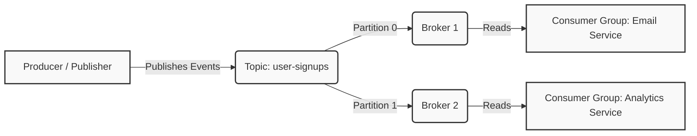

# Apache Kafka & Integration Learning Guide

This document provides an in-depth explanation of Apache Kafka's core concepts, consensus architectures (ZooKeeper vs. KRaft), the architectural goals of our project, and a detailed line-by-line walkthrough of our Node.js implementation.

---

## 📖 Part 1: What is Apache Kafka?

**Apache Kafka** is a distributed event store and stream-processing platform. It is designed to handle high-throughput, low-latency, real-time data feeds. 

Unlike traditional databases that store the **current state** of data, Kafka stores a **log of events** (history of what happened).

### Core Event Streaming Concepts



#### 1. Events (Messages)
An **Event** (also called a **Message**) represents something that happened in the real world. In Kafka, an event is written as a key-value pair, with a timestamp:
* **Key:** Used to determine which partition the message is sent to (e.g., `userId`).
* **Value:** The actual data payload (e.g., a JSON object describing the event: `{"event": "USER_CREATED", "payload": {...}}`).
* **Timestamp:** When the event occurred.

#### 2. Event Streaming
Event streaming is the practice of capturing data in real-time from event sources (databases, mobile devices, applications) as a continuous stream of events, storing them durably, and reacting to them immediately.

#### 3. Topics & Partitions
* **Topic:** A folder or category name where events are stored. For example, `user-signups`. Topics are multi-producer and multi-consumer.
* **Partitions:** Topics are split into **Partitions** spread across different servers (Brokers). This allows Kafka to scale.
  * Within a partition, messages are strictly ordered by arrival time and are append-only.
  * To scale consumption, you increase the number of partitions.

#### 4. Message Offset
An **Offset** is a sequential integer ID assigned to each message when it is written to a partition.
* Offsets are unique *only* within a specific partition.
* Consumers track their progress by saving (committing) the offset of the last message they successfully processed. If a consumer crashes and restarts, it starts reading from its last committed offset.

#### 5. Publisher (Producer)
Producers are client applications that publish (write) events to Kafka topics. The producer chooses which partition to write to, typically using a hashing algorithm on the message key (e.g., `hash(key) % total_partitions`) to ensure all events for a specific key (like a user ID) land in the same partition and remain in order.

#### 6. Consumer & Consumer Groups
Consumers are client applications that subscribe to (read and process) events from topics.
* **Consumer Group:** A group of consumers working together to read from a topic.
* **The Rule of Scale:** Each partition in a topic can only be read by *one* consumer in a consumer group at a time. If you have 3 partitions and a group of 3 consumers, each consumer reads from exactly 1 partition. If you add a 4th consumer, it will sit idle.
* Different consumer groups (e.g. `email-service` and `analytics-service`) read independently and will each receive every single message on the topic.

#### 7. Broker
A **Broker** is a single Kafka server node running in a cluster. 
* Brokers receive messages from producers, write them to disk, and serve them to consumers.
* A cluster consists of multiple brokers to share the load and provide data replication (if one broker crashes, another has a copy of the partition).

---

## 🛠️ Part 2: ZooKeeper vs. KRaft (Consensus Architectures)

For a distributed system like Kafka to work, all brokers must agree on metadata (who is the leader of which partition, which brokers are alive, etc.).

### The ZooKeeper Way
Historically, Kafka relied on **Apache ZooKeeper** to maintain cluster state, manage configuration, elect partition leaders, and detect broker failures.
* **How it worked:** ZooKeeper ran as a separate cluster outside of Kafka. Kafka brokers communicated with ZooKeeper to fetch metadata.
* **The Zab Algorithm (ZooKeeper Atomic Broadcast):** ZooKeeper uses Zab, a crash-recovery consensus protocol similar to Paxos/Raft. It establishes a primary-backup system where a leader broker processes all requests and broadcasts changes to follower brokers, requiring a quorum (majority) to agree.
* **Why ZooKeeper was deprecated:**
  1. **Dual System Overhead:** Managing two separate distributed systems (Kafka and ZooKeeper) is complex.
  2. **Metadata Bottleneck:** When a partition leader failed, ZooKeeper had to orchestrate the election of a new leader. With millions of partitions, ZooKeeper became slow, causing cluster-wide stall times.
  3. **Security/Network Complexity:** Setting up security policies (SSL/SASL) across two different systems is error-prone.

### The KRaft Way (Kafka Raft Metadata Mode)
Starting in modern Kafka (and used in our project's `docker-compose.yml` with version `3.9.1`), ZooKeeper is replaced by **KRaft**.
* **How it works:** Kafka manages its own metadata natively. A small subset of Kafka brokers are designated as "Controllers" and form a raft quorum.
* **The Raft-variant Algorithm:** KRaft uses a consensus protocol based on Raft. Metadata changes are written to an internal metadata topic (the metadata log). The controller quorum uses Raft consensus to replicate these metadata updates.
* **Advantages:**
  * No external ZooKeeper dependencies (simpler setup).
  * Can scale to support millions of partitions.
  * Near-instantaneous partition leader elections and cluster recovery.

---

## 🎯 Part 3: What We Built & Why

### The Business Goal (Why we did it)
In a traditional monolithic application, when a user signs up:
1. The app writes the user to the database.
2. The app calls an SMTP service to send a welcome email (takes 1-3 seconds).
3. The app logs sign-up metrics to an analytics service (takes 500ms).
4. The app returns a `201 Created` HTTP response to the user.

**The Problem:** If the email provider is down or slow, the user signup fails or hangs. If the analytics tracker is overloaded, the signup endpoint times out.

### The Decoupled Event-Driven Solution (What we made)
We decoupled these steps using Kafka:
1. **User Service (Database + Producer):** Saves user to PG Database, publishes a `USER_CREATED` event to the `user-signups` topic, and immediately returns success to the user (takes ~15ms).
2. **Email Service (Consumer Group 1):** Listens to `user-signups`, detects a new user, and sends the email asynchronously.
3. **Analytics Service (Consumer Group 2):** Listens to `user-signups` and tracks the signup statistics asynchronously.

If the email server goes offline, user signups still work! The email consumer will simply resume sending emails when it comes back online by reading from its last committed offset in Kafka.

---

## 🔍 Part 4: Line-by-Line Code Walkthrough

Here is the explanation of every line of our refactored codebase.

---

### File 1: Kafka Client Configuration
📄 **[src/config/kafka.js](file:///d:/kafka-demo/src/config/kafka.js)**
*Purpose: Initializes the Kafka client, sets up the topics, and manages the lifecycle of the single, shared producer.*

```javascript
// 1. Import Kafka and Partitioners classes from kafkajs module.
const { Kafka, Partitioners } = require('kafkajs');

// 2. Disable default legacy partitioner warning logs.
process.env.KAFKAJS_NO_PARTITIONER_WARNING = '1';

// 3. Instantiate the Kafka client configuration.
const kafka = new Kafka({
  clientId: 'kafka-learning', // Unique ID identifying this client application.
  // Split brokers string by comma (e.g. 'localhost:9092') into an array.
  brokers: (process.env.KAFKA_BROKERS || 'localhost:9092').split(','),
  createPartitioner: Partitioners.LegacyPartitioner, // Selects partition hashing strategy.
  retry: {
    retries: 10,             // Number of connection retries before failing.
    initialRetryTime: 300,   // Delay in milliseconds before first retry.
    factor: 0.2,             // Exponential backoff scaling factor.
  },
});

// 4. Create a single, long-lived producer instance.
const producer = kafka.producer();

// 5. Definition of the startup function to initialize Kafka.
const initKafka = async () => {
  // Instantiate an Admin client to perform management tasks.
  const admin = kafka.admin();
  await admin.connect(); // Establish admin TCP connection.

  try {
    // Attempt to pre-create topics with specific partitions.
    await admin.createTopics({
      waitForLeaders: true, // Block execution until topic partition leaders are elected.
      topics: [
        {
          topic: 'user-signups',
          numPartitions: 3,     // Scalable configuration: 3 partitions allows up to 3 parallel consumers.
          replicationFactor: 1, // Number of copies of partition data (1 since we have 1 broker in dev).
        },
      ],
    });
  } catch (error) {
    const message = error.message || '';
    // Catch-block to gracefully ignore errors if the topic already exists.
    if (
      error.type === 'TOPIC_ALREADY_EXISTS' ||
      /already exists/i.test(message) ||
      /Topic creation errors/i.test(message)
    ) {
      // Safe to ignore.
    } else {
      throw error; // Rethrow other critical errors.
    }
  } finally {
    await admin.disconnect(); // Disconnect admin client to free up connections.
  }

  // Connect the global long-lived producer to the cluster.
  await producer.connect();
  console.log('⚡ Kafka Producer connected successfully');
};

// 6. Function to gracefully terminate the producer.
const shutdownKafka = async () => {
  console.log('🔌 Shutting down Kafka producer...');
  await producer.disconnect();
};

// 7. Export dependencies for consumption in other files.
module.exports = {
  kafka,
  producer,
  initKafka,
  shutdownKafka,
};
```

---

### File 2: Kafka Producer Service
📄 **[src/kafka/producer.js](file:///d:/kafka-demo/src/kafka/producer.js)**
*Purpose: Exposes a helper to send events to Kafka.*

```javascript
// 1. Import the pre-connected, global producer instance.
const { producer } = require('../config/kafka');

// 2. Helper function to publish a JSON message to a topic.
const produceMessage = async (topic, message) => {
    // Call the kafkajs send command.
    await producer.send({
        topic,
        // Messages array accepts value as a string/Buffer. We stringify the JSON payload.
        messages: [{ value: JSON.stringify(message) }],
    });
};

module.exports = { produceMessage };
```

---

### File 3: Kafka Consumer Engine
📄 **[src/kafka/consumer.js](file:///d:/kafka-demo/src/kafka/consumer.js)**
*Purpose: Handles consumer groups registration, subscription, message loop, and teardown.*

```javascript
// 1. Import the configured kafka client.
const { kafka } = require('../config/kafka');

// 2. Track all started consumer instances to disconnect them on shutdown.
const activeConsumers = [];

// 3. Centralized helper to register and start any consumer group.
const runConsumer = async ({ topic, groupId, onMessage }) => {
  // Create a new consumer group instance.
  const consumer = kafka.consumer({ groupId });
  
  await consumer.connect(); // Establish connection.
  // Subscribe to topic. fromBeginning: true forces consumer to read past messages
  // if this is a brand new consumer group with no committed offset history.
  await consumer.subscribe({ topic, fromBeginning: true });
  
  // Start the message polling/processing loop.
  await consumer.run({
    // eachMessage is executed by KafkaJS for every incoming message.
    eachMessage: async ({ topic, partition, message }) => {
      try {
        // Convert Buffer message payload to string.
        const value = message.value ? message.value.toString() : null;
        // Delegate message processing logic to service callback.
        await onMessage(value);
      } catch (err) {
        // Catch-all prevents a single failing message from crashing the entire server.
        console.error(`❌ Error processing message on topic ${topic}:`, err);
      }
    },
  });

  // Track the running consumer.
  activeConsumers.push(consumer);
  console.log(`📥 Consumer group "${groupId}" listening on topic "${topic}"`);
  return consumer;
};

// 4. Graceful shutdown handler.
const shutdownConsumers = async () => {
  console.log('🔌 Shutting down active Kafka consumers...');
  for (const consumer of activeConsumers) {
    try {
      await consumer.disconnect(); // Disconnect each consumer cleanly.
    } catch (err) {
      console.error('Error disconnecting consumer:', err);
    }
  }
};

module.exports = { runConsumer, shutdownConsumers };
```

---

### File 4: Consumer Services
📄 **[src/services/analytics.consumer.js](file:///d:/kafka-demo/src/services/analytics.consumer.js)**
*Purpose: Evaluates metric reports on user signups.*

```javascript
// Import the centralized consumer engine and topic constant.
const { runConsumer } = require('../kafka/consumer');
const { USER_SIGNUPS } = require('../kafka/topic');

const initAnalyticsConsumer = async () => {
  await runConsumer({
    topic: USER_SIGNUPS,
    groupId: 'analytics-service-group', // Separate group ensures it gets ALL user-signups events.
    onMessage: async (messageStr) => {
      console.log(`📊 Analytics consumer received message: ${messageStr}`);
      // Add analytics processing database logic here.
    },
  });
};

module.exports = { initAnalyticsConsumer };
```

📄 **[src/services/email.consumer.js](file:///d:/kafka-demo/src/services/email.consumer.js)**
*Purpose: Sends out notification emails when user signups occur.*

```javascript
const { runConsumer } = require('../kafka/consumer');
const { USER_SIGNUPS } = require('../kafka/topic');

const initEmailConsumer = async () => {
  await runConsumer({
    topic: USER_SIGNUPS,
    groupId: 'email-service-group', // Independent consumer group.
    onMessage: async (messageStr) => {
      console.log(`📧 Email consumer received message: ${messageStr}`);
      // Add SMTP / third-party email transmission logic here.
    },
  });
};

module.exports = { initEmailConsumer };
```

---

### File 5: Server Entry Point
📄 **[src/server.js](file:///d:/kafka-demo/src/server.js)**
*Purpose: Entrypoint that orchestrates database connections, Kafka client/consumer startup, and listens for process termination signals.*

```javascript
const app = require('./app');
const db = require('./config/database');
const { initKafka, shutdownKafka } = require('./config/kafka');
const { shutdownConsumers } = require('./kafka/consumer');
const { initAnalyticsConsumer } = require('./services/analytics.consumer');
const { initEmailConsumer } = require('./services/email.consumer');

const PORT = process.env.PORT || 3000;

const start = async () => {
  // 1. Connect to PostgreSQL and sync database tables.
  await db.initDb();
  
  // 2. Initialize Kafka, create topic, and connect global producer.
  await initKafka();

  // 3. Spin up both consumer background tasks.
  await initAnalyticsConsumer();
  await initEmailConsumer();

  // 4. Start listening for incoming HTTP requests on Express.
  const server = app.listen(PORT, () => {
    console.log(`🚀 Server running on http://localhost:${PORT}`);
  });

  // 5. Graceful Shutdown orchestration function.
  const handleShutdown = async (signal) => {
    console.log(`\n🛑 Received ${signal}. Starting graceful shutdown...`);
    
    // Stop accepting new HTTP requests.
    server.close(() => console.log('HTTP server closed.'));
    
    try {
      // Disconnect all consumer group pollers to trigger partition rebalancing on broker.
      await shutdownConsumers();
      // Disconnect the shared producer connection.
      await shutdownKafka();
      console.log('✅ Graceful shutdown complete.');
      process.exit(0); // Exit process successfully.
    } catch (err) {
      console.error('❌ Error during graceful shutdown:', err);
      process.exit(1); // Exit process with failure.
    }
  };

  // Register OS termination signal listeners.
  process.on('SIGINT', () => handleShutdown('SIGINT'));   // Triggered by Ctrl+C.
  process.on('SIGTERM', () => handleShutdown('SIGTERM')); // Triggered by process manager/docker.
};

// Start application, catch global boot failures.
start().catch((error) => {
  console.error('❌ Failed to start server:', error);
  process.exit(1);
});
```

---

## ⚡ Part 5: Common Kafka Bottlenecks & Solutions

When running Kafka in production, scale and load will eventually hit hardware or network limits. Here are the major bottlenecks and how they are solved:

### 1. Consumer Lag (Slow Consumers)
* **The Bottleneck:** The producer is publishing messages faster than the consumer can process them. This causes the consumer offset to fall far behind, leading to delayed events (e.g. users receiving welcome emails 10 minutes late).
* **The Solutions:**
  1. **Scale Out (Increase Partitions and Consumers):** If your topic has 1 partition, only 1 consumer in a group can process it. By increasing the topic's partition count (e.g., to 3 or 6 partitions) and running multiple consumer instances in the same group, you scale your processing capacity horizontally.
  2. **Worker Pool Delegation:** Instead of doing heavy, blocking work (e.g., rendering PDF, contacting slow third-party APIs) directly inside the `eachMessage` handler, the consumer can hand off the work to an in-memory queue/worker pool (like a Node.js worker pool or async queue library) and return immediately.
  3. **Batch Processing (`eachBatch`):** Process messages in batches rather than one-by-one. This reduces database transaction overhead (e.g., executing one bulk database `INSERT` instead of 100 individual queries).

### 2. Consumer Rebalance Storms
* **The Bottleneck:** A consumer takes too long to process a batch of messages. Because it is blocked, it fails to send its periodic "heartbeat" to the Kafka coordinator broker. The broker thinks the consumer died, kicks it out of the group, and triggers a **rebalance** (reassigning its partitions to other consumers). This stops all consumption during the rebalance, and if the other consumers also block, it triggers a chain reaction of failures.
* **The Solutions:**
  1. **Increase Poll Intervals:** Adjust the consumer client configuration `max.poll.interval.ms` to give your code more time to process messages before Kafka assumes it's dead.
  2. **Decrease Batch Size:** Limit the maximum number of messages returned in a single poll (`max.poll.records`).

### 3. Producer Latency (TCP & Disk Overhead)
* **The Bottleneck:** High latency on publishing messages, causing web requests to hang.
* **The Solutions:**
  1. **Connection Reuse:** Do not connect and disconnect on every request (which we resolved in our refactoring by sharing the producer!).
  2. **Configure Acknowledgment Levels (`acks`):**
     * `acks=0`: Producer doesn't wait for any broker reply. Fastest, but messages can be lost if a broker crashes.
     * `acks=1` (Default): Producer waits for the partition leader broker to write the message to disk. Good balance of speed and reliability.
     * `acks=all`: Producer waits for all replica brokers to write to disk. Slowest, but guarantees zero data loss.
  3. **Compression:** Enable compression (`gzip`, `snappy`, `lz4`, or `zstd`) in the producer configuration. This reduces the size of data transmitted over the network and saved to broker disks.
  4. **Batching & Lingering:** Set `lingerMs` (e.g. `lingerMs: 10`) on the producer to instruct the client to wait a few milliseconds to group multiple incoming messages into a single network batch, significantly increasing throughput.

### 4. Broker Disk and Network I/O
* **The Bottleneck:** Kafka brokers run out of disk space or hit network card limits.
* **The Solutions:**
  1. **Topic Retention Policies:** Set retention periods (`log.retention.hours` or `log.retention.bytes`) so Kafka automatically deletes old messages (e.g. keeping events for only 7 days).
  2. **Zero-Copy Optimization:** Kafka uses the OS page cache and the `sendfile` system call to bypass copying data into application memory space, writing directly from disk cache to the network socket. Ensuring your OS has plenty of free RAM for page caching solves disk read limits.
